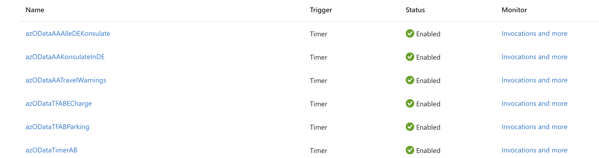
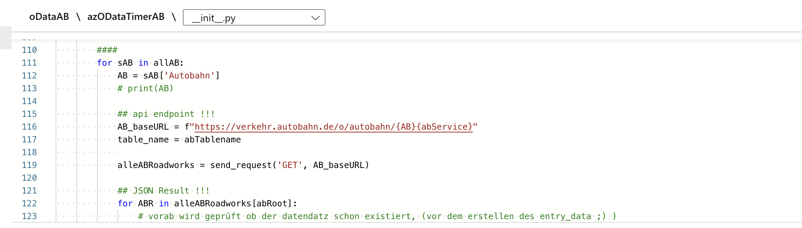
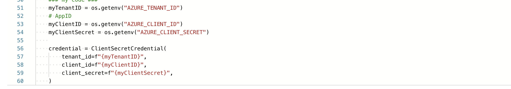
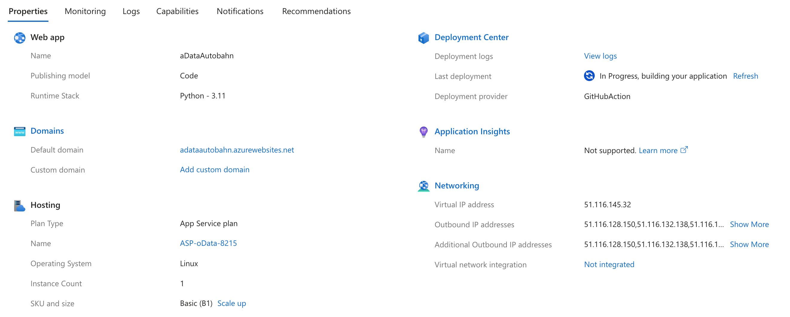
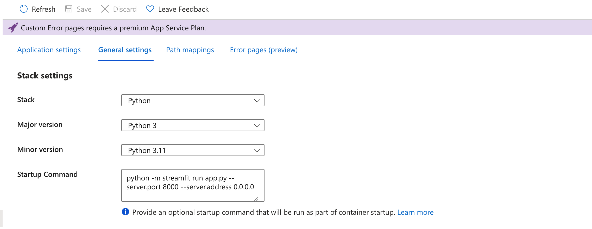
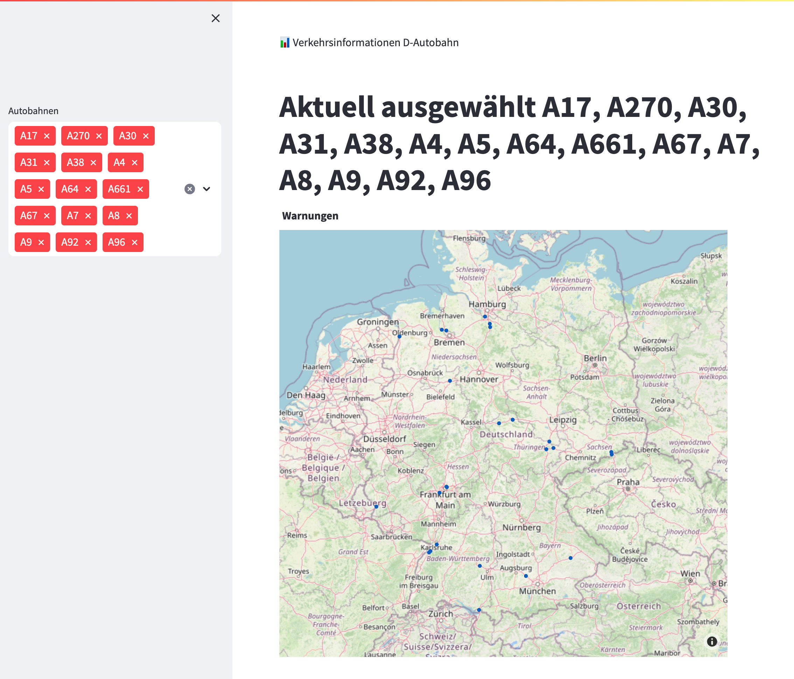

# oDataAutobahn
oData Autobahn Warnings Roadworks Closures ...

Einfache Streamlit app on Azure Web App Service zum anzeigen diversen Informationen bzgl. Deutscher Autobahnen

Die Daten stammen vom oDataProjekt der Autobahngesellschaft
https://autobahn.api.bund.dev/

Zuerst werden die Daten via AzureFunctions in eine AzureTable 'kopiert'. Das passiert jede Stunde

Hier ein Codeschnipsel (später dann auch noch auf Github)

Die Tenantrelevanten Daten werden natürlich über Enviroment-Daten und Azure KeyVault übergeben

Dann werden die Daten über eine Azure-Web-App via Streamlit und Plotly aufbereitet und zur Verfügung gestellt.
Das ganze deployment erfolgt über Github.

Gestartet wird die app.py

Die Karte zeigt dann zu beginn alle Stauwarnungen. Über die Selectbox können dann entsprechend einzelne Autobahnen ausgewählt werden. Die Seite lässt sich dann über die URL https://adataautobahn.azurewebsites.net/ aufrufen (Die Domain kann natürlich auf die eigene Domain angepasst werden).

